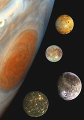

# Markdown - lenguaje de marcado


## Trabajo previo

### Instalación de software
[Visual Studio Code](https://code.visualstudio.com/). Editor de código fuente. Se recomienda instalar las siguientes extensiones para editar documentos Markdown:

- Markdown All in One
- markdownlint
- Markdown Preview Enhanced

### Tutoriales
*Markdown Tutorial*. (s.f.). Recuperado el 1 de marzo de 2024, de [https://www.markdowntutorial.com/](https://www.markdowntutorial.com/)

### Otros
Cree una cuenta gratuita en la plataforma de desarrollo colaborativo [GitHub](https://github.com/).


## Introducción
[Markdown](https://daringfireball.net/projects/markdown/) es un [lenguaje de marcado](https://es.wikipedia.org/wiki/Lenguaje_de_marcado), creado en 2004 por John Gruber y Aaron Swartz. Las "marcas" se utilizan para especificar aspectos de la estructura (ej. títulos, encabezados), estilo (ej. negritas, itálicas) y semántica de un documento. Markdown se caracteriza por ser más sencillo de leer y de usar que otros lenguajes de marcado (ej. [Lenguaje de Marcado de Hipertexto o HTML](https://es.wikipedia.org/wiki/HTML)), por lo que se considera un [lenguaje de marcado ligero](https://es.wikipedia.org/wiki/Lenguaje_de_marcas_ligero).

Los documentos escritos en Markdown pueden exportarse a una gran variedad de formatos (ej. HTML, DOC, PDF, LaTex) para ser usados en libros, presentaciones o páginas web, entre otros.

Las variaciones de Markdown, también llamadas *flavors*, son extensiones o modificaciones de la [especificación original]((https://daringfireball.net/projects/markdown/)). Entre las más populares están:

- [Python Markdown](https://github.com/Python-Markdown/markdown): para el lenguaje Python.
- [GitHub Flavored Markdown](https://help.github.com/en/github/writing-on-github): para la plataforma GitHub.
- [Pandoc's Markdown](https://pandoc.org/MANUAL.html#pandocs-markdown): para el programa [Pandoc](https://pandoc.org/) de conversión entre formatos.
- [Quarto](https://quarto.org/): más que un *flavor* de Markdown es un sistema de publicación de documentos técnicos y científicos que utiliza Markdown. Tiene soporte para incluir y ejecutar código en R, Python, Julia y Observable.

Puede encontrarse una lista más extensa de variaciones de Markdown en [Markdown Flavors](https://github.com/commonmark/commonmark-spec/wiki/markdown-flavors).


## Ejemplo de documento
El siguiente es un ejemplo de la sintaxis de Markdown, con marcas para un encabezado, texto en negrita, texto en itálica, un hipervínculo y una imagen.

***

```` md
### Los satélites galileanos

Se llaman **satélites galileanos** los cuatro satélites
de Júpiter descubiertos en 1610 por 
[Galileo Galilei](https://es.wikipedia.org/wiki/Galileo_Galilei): 
*Ío*, *Europa*, *Ganimedes* y *Calisto*. 
Son los más grandes de los satélites de Júpiter, 
siendo visibles incluso con telescopios de baja potencia.


**Figura 1**. Los cuatro satélites galileanos, 
en una composición que compara sus tamaños con el tamaño de Júpiter. 
En orden descendente, son *Ío*, *Europa*, *Ganimedes* y *Calisto*.

````

***

El documento se visualiza de la siguiente manera:

***
### Los satélites galileanos

Se llaman **satélites galileanos** los cuatro satélites
de Júpiter descubiertos en 1610 por 
[Galileo Galilei](https://es.wikipedia.org/wiki/Galileo_Galilei): 
*Ío*, *Europa*, *Ganimedes* y *Calisto*. 
Son los más grandes de los satélites de Júpiter, 
siendo visibles incluso con telescopios de baja potencia.


**Figura 1**. Los cuatro satélites galileanos, 
en una composición que compara sus tamaños con el tamaño de Júpiter. 
En orden descendente, son *Ío*, *Europa*, *Ganimedes* y *Calisto*.

***

El contenido de este ejemplo está basado en [Satélite galileano - Wikipedia, la enciclopedia libre](https://es.wikipedia.org/wiki/Sat%C3%A9lite_galileano).


## Sintaxis
En esta sección, se explican los principales elementos de sintaxis de Markdown y se muestran sus salidas.

<style>
  table, th, td {
    border: 1px solid black;
    border-collapse: collapse;
  }
  
  td {
    vertical-align: middle;
    padding-top: 15px;
    padding-bottom: 15px;
    padding-left: 15px;
    padding-right: 15px;        
  }
  
  th {
    text-align: center;
    vertical-align: middle;
    padding-top: 15px;
    padding-bottom: 15px;
    padding-left: 15px;
    padding-right: 15px;     
  }  
</style>

### Encabezados
Hay seis niveles de encabezados en Markdown, siendo el nivel 1 el de letras más grandes y el 6 el de letras más pequeñas. Se especifican mediante símbolos de numeral (`#`) antes del texto del encabezado (note el espacio entre el último signo de numeral y el inicio del texto).

<table>
  <tr>
    <th>Sintaxis Markdown</th>
    <th>Salida</th>
  </tr>
  <tr>
    <td>
      # Encabezado de nivel 1
    </td>
    <td>
      <h1>Encabezado de nivel 1</h1>
    </td>
  </tr>
  <tr>
    <td>
      ## Encabezado de nivel 2
    </td>
    <td>
      <h2>Encabezado de nivel 2</h2>
    </td>
  </tr>  
  <tr>
    <td>
      ### Encabezado de nivel 3
    </td>
    <td>
      <h3>Encabezado de nivel 3</h3>
    </td>
  </tr>  
  <tr>
    <td>
      #### Encabezado de nivel 4
    </td>
    <td>
      <h4>Encabezado de nivel 4</h4>
    </td>
  </tr>    
  <tr>
    <td>
      ##### Encabezado de nivel 5
    </td>
    <td>
      <h5>Encabezado de nivel 5</h5>
    </td>
  </tr>    
  <tr>
    <td>
      ###### Encabezado de nivel 6
    </td>
    <td>
      <h6>Encabezado de nivel 6</h6>
    </td>
  </tr>    
</table> 

Para los encabezados de nivel 1 y nivel 2, existe una sintaxis alterna, con símbolos de igual (`=====`) o guiones (`-----`) bajo el texto del encabezado.

<table>
  <tr>
    <th>Sintaxis Markdown</th>
    <th>Salida</th>
  </tr>
  <tr>
    <td>
      Otro encabezado de nivel 1<br>
      ==========================
    </td>
    <td>
      <h1>Otro encabezado de nivel 1</h1>
    </td>
  </tr>
  <tr>
    <td>
      Otro encabezado de nivel 2<br>
      --------------------------
    </td>
    <td>
      <h2>Otro encabezado de nivel 2</h2>
    </td>
  </tr>  
</table>


### Párrafos
Los párrafos deben separarse mediante (al menos) una línea en blanco. Un simple cambio de línea no generará un nuevo párrafo.

<table>
  <tr>
    <th>Sintaxis Markdown</th>
    <th>Salida</th>
  </tr>
  <tr>
    <td>
      Este es el texto que corresponde al primer párrafo de un documento.<p><p>
      Este es el texto que corresponde al segundo párrafo de un documento.
    </td>
    <td>
      Este es el texto que corresponde al primer párrafo de un documento.<p><p>
      Este es el texto que corresponde al segundo párrafo de un documento.
    </td>
  </tr>
</table>


### Negrita
Hay dos sintaxis para especificar texto en *negrita*: con dos asteriscos (`**`) o con dos guiones bajos (`__`), antes y después del texto.

<table>
  <tr>
    <th>Sintaxis Markdown</th>
    <th>Salida</th>
  </tr>
  <tr>
    <td>
      **Texto en negrita**
    </td>
    <td>
      <strong>Texto en negrita</strong>
    </td>
  </tr>
  <tr>
    <td>
      __Otro texto en negrita__
    </td>
    <td>
      <strong>Otro texto en negrita</strong>
    </td>
  </tr>  
</table>


### Itálica
Hay dos sintaxis para especificar texto en *itálica*: con un asterisco (`*`) o con un guión bajo (`_`), antes y después del texto.

<table>
  <tr>
    <th>Sintaxis Markdown</th>
    <th>Salida</th>
  </tr>
  <tr>
    <td>
      *Texto en itálica*
    </td>
    <td>
      <em>Texto en itálica</em>
    </td>
  </tr>
  <tr>
    <td>
      _Otro texto en itálica_
    </td>
    <td>
      <em>Otro texto en itálica</em>
    </td>
  </tr>  
</table>


### Citas textuales
Se especifican con un símbolo de "mayor que" (`>`) antes de cada línea.

<table>
  <tr>
    <th>Sintaxis Markdown</th>
    <th>Salida</th>
  </tr>
  <tr>
    <td>
      > *And on the pedestal these words appear:*<br>
      > *"My name is Ozymandias, king of kings:*<br>
      > *Look on my works, ye Mighty, and despair!"*<br>
      Percy Bysshe Shelley, "Ozymandias" (1818)
    </td>
    <td>
      <blockquote>
        <em>
          "And on the pedestal these words appear:<br>
          "My name is Ozymandias, king of kings:<br>
          Look on my works, ye Mighty, and despair!"<br>
        </em>
      </blockquote>
      Percy Bysshe Shelley, "Ozymandias" (1818)
    </td>
  </tr>
</table>


### Enlaces (hipervínculos)
Se definen con paréntesis cuadrados (`[]`) seguidos de paréntesis redondos (`()`). En los paréntesis cuadrados se coloca (opcionalmente) el texto del enlace y en los redondos la dirección del documento al que conduce el enlace.

<table>
  <tr>
    <th>Sintaxis Markdown</th>
    <th>Salida</th>
  </tr>
  <tr>
    <td>
      [Proyecto Gutenberg](https://www.gutenberg.org/)
    </td>
    <td>
      <a href="https://www.gutenberg.org/">Proyecto Gutenberg</a>
    </td>
  </tr>
</table>


### Imágenes
Se definen con un signo de admiración de cierre (`!`), paréntesis cuadrados (`[]`) y paréntesis redondos (`()`). En los paréntesis cuadrados se coloca (opcionalmente) un texto alternativo de la imagen y en los redondos la dirección de la imagen, ya sea local o remota.

<table>
  <tr>
    <th>Sintaxis Markdown</th>
    <th>Salida</th>
  </tr>
  <tr>
    <td>
      
    </td>
    <td>
      
    </td>
  </tr>
  <tr>
    <td>
      
    </td>
    <td>
      
    </td>
  </tr>  
</table>


### Listas numeradas
Se definen con números (`1. 2. 3. ...`) antes de cada elemento.

<table>
  <tr>
    <th>Sintaxis Markdown</th>
    <th>Salida</th>
  </tr>
  <tr>
    <td>
1. Primer elemento.<br>  
2. Segundo elemento.<br>  
3. Tercer elemento.<br>  
    </td>
    <td>
1. Primer elemento.<br>
2. Segundo elemento.<br>
3. Tercer elemento.<br>
    </td>
  </tr>
</table>

### Listas no numeradas
Se definen con guiones (`-`) o asteriscos (`*`) antes de cada elemento.

<table>
  <tr>
    <th>Sintaxis Markdown</th>
    <th>Salida</th>
  </tr>
  <tr>
    <td>
- Un elemento.<br>  
- Otro elemento.<br>  
- Otro elemento más.<br>  
    </td>
    <td>
- Un elemento.<br>  
- Otro elemento.<br>  
- Otro elemento más.<br>  
    </td>
  </tr>
</table>


### Notación matemática
Las expresiones en notación matemática (ej. ecuaciones) se escriben con base en la sintaxis de [LaTeX](https://latex-project.org/). Se delimitan (al inicio y al final) con:

- Un símbolo de dólar (`$`), para ecuaciones dentro de un renglón (*inline math*).
- Dos símbolos de dólar (`$$`), para ecuaciones en su propio bloque (*display math*).

<table>
  <tr>
    <th>Sintaxis Markdown</th>
    <th>Salida</th>
  </tr>
  <tr>
    <td>
<p>Equivalencia entre masa y energía: $E = mc^{2}$<p>  
    </td>
    <td>
Equivalencia entre masa y energía: $E = mc^{2}$
    </td>
  </tr>
  <tr>
    <td>
<p>Equivalencia entre masa y energía:</p>
$$E = mc^{2}$$
    </td>
    <td>
Equivalencia entre masa y energía:
$$E = mc^{2}$$
    </td>
  </tr>  
</table>

Para más detalles sobre la sintaxis de las expresiones matemáticas, se recomienda consultar:

- [Writing mathematical expressions - GitHub Docs](https://docs.github.com/en/get-started/writing-on-github/working-with-advanced-formatting/writing-mathematical-expressions)
- [LaTeX/Mathematics](https://en.wikibooks.org/wiki/LaTeX/Mathematics)


## Ejercicios

1. Con VSCode, cree un documento Markdown llamado `README.md` y escriba en este un breve *curriculum* académico o profesional (puede elegir otro tema).

    a. Incluya información como: nombre, fotografía, datos de contacto, áreas de interés, carrera, cursos aprobados, publicaciones, etc.  
    b. Puede usar información ficticia (**no incluya datos confidenciales o sensibles**).  
    c. Especifique la fuente de las imágenes (y de cualquier otra información para la que sea necesario) y no utilice imágenes para las que no tiene autorización. Considere utilizar sitios con imágenes con licencias abiertas (ej. [Wikimedia Commons](https://commons.wikimedia.org/), [Unsplash](https://unsplash.com/), [FreeImages](https://www.freeimages.com/)).  
    d. Asegúrese de utilizar los siguientes elementos de sintaxis Markdown:

        -   Encabezados de varios niveles.
        -   Negritas e itálicas.
        -   Listas.
        -   Enlaces a sitios web.
        -   Imágenes (al menos una local y una remota).

2. En GitHub, cree un repositorio llamado `cv` y suba el archivo creado en el paso 1.

3. Publique el documento en [GitHub Pages](https://pages.github.com/) con *Settings - Pages - Branch - Save*.


## Recursos de interés
*Daring Fireball: Markdown*. (s. f.). Recuperado 25 de marzo de 2023, de [https://daringfireball.net/projects/markdown/](https://daringfireball.net/projects/markdown/)

*LaTeX/Mathematics—Wikibooks, open books for an open world*. (s. f.). Recuperado 25 de marzo de 2023, de [https://en.wikibooks.org/wiki/LaTeX/Mathematics](https://en.wikibooks.org/wiki/LaTeX/Mathematics)

*Markdown Guide*. (s. f.). Recuperado 10 de abril de 2022, de [https://www.markdownguide.org/](https://www.markdownguide.org/)

Writing mathematical expressions. (s. f.). *GitHub Docs*. Recuperado 25 de marzo de 2023, de [https://ghdocs-prod.azurewebsites.net/en/get-started/writing-on-github/working-with-advanced-formatting/writing-mathematical-expressions](https://ghdocs-prod.azurewebsites.net/en/get-started/writing-on-github/working-with-advanced-formatting/writing-mathematical-expressions)